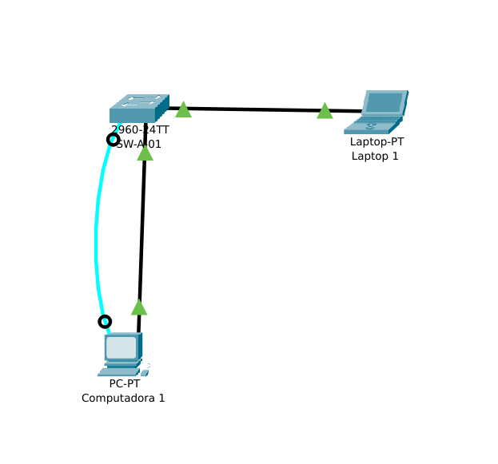

# Práctica 1

## Objetivo de la práctica

- Configurar parámetros básicos en un Switch de Cisco y verificar conectividad

## Materiales necesarios

- Packet Tracer

## Descripción del escenario

- Diagrama
- 
  
- Lista de Dispositivos
  - Switches
    - 2960
  - End Devices
    - PC
- Direccionamiento IP

## Requerimientos técnicos

- Configurar hostname
- Configurar contraseñas (console, vty, enable)
- Configurar interfaces
- Configurar VLANs
- Probar conectividad

## Procedimiento

Cambiar el nombre de Hostname de los Switches:

- Switch1 -> SW-A-01

### Cambiar Hostname

Ingresar a la consola del Switch1:
```bash
Switch>
Switch> enable
Switch# configure terminal
Switch(config)# hostname SW-A-01
SW-A-01(config)#
```

### Configurar contraseñas

Contraseña de Enable:
```bash
SW-A-01(config)#
SW-A-01(config)# enable secret C15c0
```

Contraseña de lineas VTY:
```bash
SW-A-01(config)# line vty 0 4
SW-A-01(config-line)# password C15c0
SW-A-01(config-line)# login
SW-A-01(config-line)# exit
SW-A-01(config)#
```

Verificar con:
``bash
SW-A-01(config)# show running-config
```

Output:
``bash
Building configuration...

Current configuration : 1146 bytes
!
version 15.0
no service timestamps log datetime msec
no service timestamps debug datetime msec
no service password-encryption
!
hostname SW-A-01
!
enable secret 5 $1$mERr$nLBWFU.fXR.UOk4SpscWr0
!
!
!
!
!
!
spanning-tree mode pvst
spanning-tree extend system-id
!
interface FastEthernet0/1
!
interface FastEthernet0/2
!
interface FastEthernet0/3
!
interface FastEthernet0/4
!
interface FastEthernet0/5
!
interface FastEthernet0/6
!
interface FastEthernet0/7
!
interface FastEthernet0/8
!
interface FastEthernet0/9
!
interface FastEthernet0/10
!
interface FastEthernet0/11
!
interface FastEthernet0/12
!
interface FastEthernet0/13
!
interface FastEthernet0/14
!
interface FastEthernet0/15
!
interface FastEthernet0/16
!
interface FastEthernet0/17
!
interface FastEthernet0/18
!
interface FastEthernet0/19
!
interface FastEthernet0/20
!
interface FastEthernet0/21
!
interface FastEthernet0/22
!
interface FastEthernet0/23
!
interface FastEthernet0/24
!
interface GigabitEthernet0/1
!
interface GigabitEthernet0/2
!
interface Vlan1
 no ip address
 shutdown
!
!
!
!
line con 0
!
line vty 0 4
 password C15c0
 login
line vty 5 15
 login
!
!
!
!
end
```

Configurar encriptación de contraseñas:
```bash
SW-A-01(config)#service password-encryption 
```

Verificar con:
```bash
SW-A-01(config)# show running-config
```

Output:
```bash
...
!
enable secret 5 $1$mERr$nLBWFU.fXR.UOk4SpscWr0
!
...
!
line con 0
!
line vty 0 4
 password 7 08021D1B0A49
 login
line vty 5 15
 login
!
...
```

### Configurar Interfaces
Configurar la interfaces involucradas:
```bash
SW-A-01(config)#interface fastEthernet 0/1
SW-A-01(config-if)#switchport mode access 
SW-A-01(config-if)#switchport access vlan 1
SW-A-01(config-if)#exit
```
Para verificar:
```bash
SW-A-01#show vlan brief
```
Output:
```bash
VLAN Name                             Status    Ports
---- -------------------------------- --------- -------------------------------
1    default                          active    Fa0/1, Fa0/2, Fa0/3, Fa0/4
                                                Fa0/5, Fa0/6, Fa0/7, Fa0/8
                                                Fa0/9, Fa0/10, Fa0/11, Fa0/12
                                                Fa0/13, Fa0/14, Fa0/15, Fa0/16
                                                Fa0/17, Fa0/18, Fa0/19, Fa0/20
                                                Fa0/21, Fa0/22, Fa0/23, Fa0/24
                                                Gig0/1, Gig0/2
1002 fddi-default                     active    
1003 token-ring-default               active    
1004 fddinet-default                  active    
1005 trnet-default                    active    
```

### Configurar Computadoras

Configurar a la `Computadora 1` la siguiente configuración de Red:

- IPv4 Address: 192.168.100.11
- Subnet Mask: 255.255.255.0
- Default Gateway: 192.168.100.254

Configurar a la `Laptop 1` la siguiente configuración de Red:

- IPv4 Address: 192.168.100.12
- Subnet Mask: 255.255.255.0
- Default Gateway: 192.168.100.254

Verificar conectividad entre hosts:

Desde `Computadora 1`:
```bash
ping 192.168.100.12

Pinging 192.168.100.12 with 32 bytes of data:

Reply from 192.168.100.12: bytes=32 time=9ms TTL=128
Reply from 192.168.100.12: bytes=32 time<1ms TTL=128
Reply from 192.168.100.12: bytes=32 time<1ms TTL=128
Reply from 192.168.100.12: bytes=32 time<1ms TTL=128
```
Desde `Laptop 1`:
```bash
ping 192.168.100.11

Pinging 192.168.100.11 with 32 bytes of data:

Reply from 192.168.100.11: bytes=32 time=8ms TTL=128
Reply from 192.168.100.11: bytes=32 time<1ms TTL=128
Reply from 192.168.100.11: bytes=32 time<1ms TTL=128
Reply from 192.168.100.11: bytes=32 time<1ms TTL=128
```

### Guardar la configuración de Switch
Para Guardar la configuración:
```bash
SW-A-01#write 
SW-A-01#wr
Building configuration...
[OK]
```
O:
```bash
SW-A-01#copy running-config startup-config 
```

## Entregables

- Archivo  `.pkt` de Cisco Packet Tracer configurado
- Documento de comandos y evidencia de la configuración