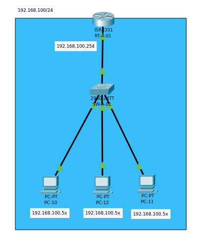

# Práctica 3

## Objetivo de la práctica

- Configuración de Switch
- Configuración de Router
  - Configuración de interfaces de red
  - Configuración de DHCP
- Verificación de conectividad entre hosts

## Materiales necesarios

- Packet Tracer

## Descripción del escenario

- Diagrama
  
  
- Lista de Dispositivos
  - Router
    - 4331
  - Switches
    - 2960
  - End Devices
    - PC
- Direccionamiento IP
  | Device | Network | Netmask | Gateway |
  |-|-|-|-|
  | - | 192.168.100.0 | 255.255.255.0 | 192.168.100.254 |
  | PC-10 | 192.168.100.10 | 255.255.255.0 | - |
  | PC-11 | 192.168.100.11 | 255.255.255.0 | - |

## Requerimientos técnicos

- Configurar hostname
- Configurar contraseñas (console, vty, enable)
- Configurar interfaces
- Probar conectividad

## Procedimiento de Switch SW-A-01

Cambiar el nombre de Hostname de los Switches:

- Switch1 -> SW-A-01

### Cambiar Hostname

Ingresar a la consola del Switch1:
```bash
Switch>
Switch> enable
Switch# configure terminal
Switch(config)# hostname SW-A-01
SW-A-01(config)#
```

### Configurar contraseñas

Contraseña de Enable:
```bash
SW-A-01(config)#
SW-A-01(config)# enable secret P4ssw0rd
```

Contraseña de lineas VTY:
```bash
SW-A-01(config)# line console 0
SW-A-01(config-line)# password P4ssw0rd
SW-A-01(config-line)# login
SW-A-01(config-line)# exit

SW-A-01(config)# line vty 0 4
SW-A-01(config-line)# password P4ssw0rd
SW-A-01(config-line)# login
SW-A-01(config-line)# exit
SW-A-01(config)#
```

Configurar encriptación de contraseñas:
```bash
SW-A-01(config)#service password-encryption 
```

Verificar con:
```bash
SW-A-01(config)# show running-config
```

## Procedimiento de Router RT-A-01

Cambiar el nombre de Hostname de los Switches:

- Router1 -> RT-A-01

### Cambiar Hostname

Ingresar a la consola del Switch1:
```bash
Router>
Router>enable
Router#configure terminal 
Router(config)#
Router(config)#hostname RT-A-01
RT-A-01(config)
```

### Configurar contraseñas

Contraseña de Enable:
```bash
RT-A-01(config)#enable secret P4ssw0rd
```

Contraseña de lineas Console y VTY:
```bash
RT-A-01(config)#line console 0
RT-A-01(config-line)#password P4ssw0rd
RT-A-01(config-line)#login
RT-A-01(config-line)#exit

RT-A-01(config)#line vty 0 4
RT-A-01(config-line)#password P4ssw0rd
RT-A-01(config-line)#login
RT-A-01(config-line)#exit
```

Configurar encriptación de contraseñas:
```bash
SW-A-01(config)#service password-encryption 
```

Verificar con:
```bash
RT-A-01#show running-config  
```

Output:
```bash
hostname RT-A-01
!
enable secret 5 $1$mERr$E3IhUECs7InEu9fahnKbv.
!
ip cef
no ipv6 cef
!
spanning-tree mode pvst
!
interface GigabitEthernet0/0/0
 no ip address
 duplex auto
 speed auto
 shutdown
!
interface GigabitEthernet0/0/1
 no ip address
 duplex auto
 speed auto
 shutdown
!
interface GigabitEthernet0/0/2
 no ip address
 duplex auto
 speed auto
 shutdown
!
interface Vlan1
 no ip address
 shutdown
!
ip classless
!
ip flow-export version 9
!
line con 0
 password 7 08344A43
 login
!
line aux 0
!
line vty 0 4
 password 7 08344A43
 login
!
end


RT-A-01# 
RT-A-01#wri
RT-A-01#write 
Building configuration...
[OK]
```
Configurar la interfaz de red:

```bash
RT-A-01(config)#interface GigabitEthernet0/0/1
RT-A-01(config-if)#ip address 192.168.100.254 
RT-A-01(config-if)#ip address 192.168.100.254 ?
  A.B.C.D  IP subnet mask
RT-A-01(config-if)#ip address 192.168.100.254 255.255.255.0
RT-A-01(config-if)#no shu
RT-A-01(config-if)#no shutdown
RT-A-01(config-if)#exit
```
Output:
```bash
%LINK-5-CHANGED: Interface GigabitEthernet0/0/1, changed state to up
```
Para verificar:
```bash
RT-A-01#show ip interface brief
```
Output:
```bash
Interface              IP-Address      OK? Method Status                Protocol 
GigabitEthernet0/0/0   unassigned      YES unset  administratively down down 
GigabitEthernet0/0/1   192.168.100.254 YES manual up                    down <-----
GigabitEthernet0/0/2   unassigned      YES unset  administratively down down 
Vlan1                  unassigned      YES unset  administratively down down
```
## Configuración de PC

### PC-10:
```bash
FastEthernet0 Connection:(default port)

   Connection-specific DNS Suffix..: 
   Link-local IPv6 Address.........: FE80::2E0:F9FF:FEDD:4D42
   IPv6 Address....................: ::
   IPv4 Address....................: 192.168.100.10
   Subnet Mask.....................: 255.255.255.0
   Default Gateway.................: ::
                                     192.168.100.254
```
Verificar con ping a los otros equipos:
```bash
C:\>ping 192.168.100.254

Pinging 192.168.100.254 with 32 bytes of data:

Reply from 192.168.100.254: bytes=32 time<1ms TTL=255
Reply from 192.168.100.254: bytes=32 time<1ms TTL=255
Reply from 192.168.100.254: bytes=32 time<1ms TTL=255
Reply from 192.168.100.254: bytes=32 time<1ms TTL=255

Ping statistics for 192.168.100.254:
    Packets: Sent = 4, Received = 4, Lost = 0 (0% loss),
Approximate round trip times in milli-seconds:
    Minimum = 0ms, Maximum = 0ms, Average = 0ms

C:\>ping 192.168.100.11

Pinging 192.168.100.11 with 32 bytes of data:

Reply from 192.168.100.11: bytes=32 time<1ms TTL=128
Reply from 192.168.100.11: bytes=32 time<1ms TTL=128
Reply from 192.168.100.11: bytes=32 time<1ms TTL=128
Reply from 192.168.100.11: bytes=32 time<1ms TTL=128

Ping statistics for 192.168.100.11:
    Packets: Sent = 4, Received = 4, Lost = 0 (0% loss),
Approximate round trip times in milli-seconds:
    Minimum = 0ms, Maximum = 0ms, Average = 0ms

```
### PC-11
```bash
FastEthernet0 Connection:(default port)

   Connection-specific DNS Suffix..: 
   Link-local IPv6 Address.........: FE80::201:64FF:FE1E:930D
   IPv6 Address....................: ::
   IPv4 Address....................: 192.168.100.11
   Subnet Mask.....................: 255.255.255.0
   Default Gateway.................: ::
                                     192.168.100.254
```
Verificar con ping a los otros equipos:

```bash
C:\>ping 192.168.100.10

Pinging 192.168.100.10 with 32 bytes of data:

Reply from 192.168.100.10: bytes=32 time<1ms TTL=128
Reply from 192.168.100.10: bytes=32 time<1ms TTL=128
Reply from 192.168.100.10: bytes=32 time<1ms TTL=128
Reply from 192.168.100.10: bytes=32 time<1ms TTL=128

Ping statistics for 192.168.100.10:
    Packets: Sent = 4, Received = 4, Lost = 0 (0% loss),
Approximate round trip times in milli-seconds:
    Minimum = 0ms, Maximum = 0ms, Average = 0ms

C:\>ping 192.168.100.254

Pinging 192.168.100.254 with 32 bytes of data:

Reply from 192.168.100.254: bytes=32 time<1ms TTL=255
Reply from 192.168.100.254: bytes=32 time<1ms TTL=255
Reply from 192.168.100.254: bytes=32 time<1ms TTL=255
Reply from 192.168.100.254: bytes=32 time<1ms TTL=255

Ping statistics for 192.168.100.254:
    Packets: Sent = 4, Received = 4, Lost = 0 (0% loss),
Approximate round trip times in milli-seconds:
    Minimum = 0ms, Maximum = 0ms, Average = 0ms

```

## Procedimiento de Router RT-A-01

Excluir IPs
```bash
RT-A-01#configure terminal 
RT-A-01(dhcp-config)#ip dhcp excluded-address 192.168.100.1 192.168.100.50
```
Configurar DHCP en el Router:
```bash
RT-A-01(config)#ip dhcp pool LAN
RT-A-01(dhcp-config)#network 192.168.100.0 255.255.255.0
RT-A-01(dhcp-config)#default-router 192.168.100.254
RT-A-01(dhcp-config)#dns-server 192.168.100.254
RT-A-01(dhcp-config)#exit
```
## Configuración de PC

Cambiar la configuración estática de la PC a DHCP:

### PC-10

```bash
FastEthernet0 Connection:(default port)

   Connection-specific DNS Suffix..: 
   Link-local IPv6 Address.........: FE80::2E0:F9FF:FEDD:4D42
   IPv6 Address....................: ::
   IPv4 Address....................: 192.168.100.51
   Subnet Mask.....................: 255.255.255.0
   Default Gateway.................: ::
                                     192.168.100.254
```
### PC-11
```bash
FastEthernet0 Connection:(default port)

   Connection-specific DNS Suffix..: 
   Link-local IPv6 Address.........: FE80::201:64FF:FE1E:930D
   IPv6 Address....................: ::
   IPv4 Address....................: 192.168.100.52
   Subnet Mask.....................: 255.255.255.0
   Default Gateway.................: ::
                                     192.168.100.254
```
