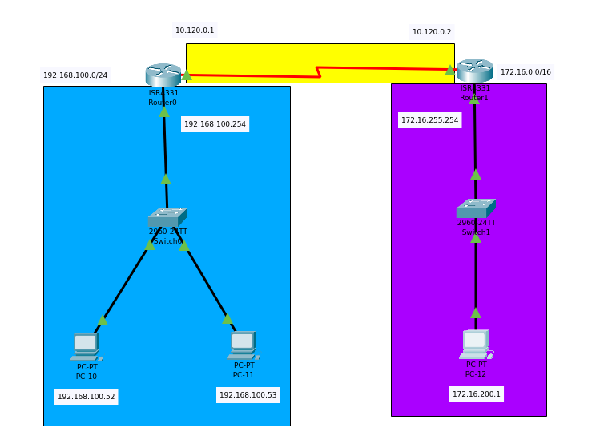

# Práctica 5

## Objetivo de la práctica

- Agregar un segundo router en Packet Tracer y configurar una ruta estática de 1 salto para comunicar dos LANs.

## Materiales necesarios

- Packet Tracer
- Archivo .pkt de esta práctica: Practica_5.pkt

## Descripción del escenario

- Diagrama
  
- Lista de Dispositivos
  - Routers
    - RT-A-01 (4331)
    - RT-B-01 (4331)
  - Switches
    - 2960 x2
  - End Devices
    - PC-11, PC-12
- Direccionamiento IP propuesto

  | Segmento | Red | Máscara | Gateway |
  |-|-|-|-|
  | LAN-A (RT-A-01) | 192.168.100.0 | 255.255.255.0 | 192.168.100.254 |
  | LAN-B (RT-B-01) | 172.16.0.0 | 255.255.255.0 | 172.16.255.254 |
  | Enlace RTA-RTB | 10.120.0.0/30 | 255.255.255.252 | 10.120.0.1 ↔ 10.120.0.2 |

## Requerimientos técnicos

- Configurar hostname y contraseñas básicas (enable, console, vty) en ambos routers.
- Configurar interfaces de LAN y del enlace entre routers.
- Configurar ruta estática de 1 salto en cada router:
  - RT-A-01: ruta hacia 172.16.0.0/24 vía 10.120.0.2
  - RT-B-01: ruta hacia 192.168.100.0/24 vía 10.120.0.1
- Verificar conectividad extremo a extremo.
- Guardar configuración.

---

## Procedimiento de Switches (SW-A-01 y SW-B-01)

En cada switch, configura el puerto de acceso hacia la PC:

```bash
Switch(config)#interface fastEthernet 0/1
Switch(config-if)#switchport mode access
Switch(config-if)#switchport access vlan 1
Switch(config-if)#description Hacia-PC
Switch(config-if)#exit
```

Si usas puertos Gigabit hacia el router, no requieren configuración L3 (son puertos L2):

```bash
Switch#show interfaces status
Switch#show vlan brief
```

---

## Procedimiento Router RT-A-01

Cambiar hostname y contraseñas:

```bash
Router>enable
Router#configure terminal
Router(config)#hostname RT-A-01
RT-A-01(config)#enable secret P4ssw0rd
RT-A-01(config)#line console 0
RT-A-01(config-line)#password P4ssw0rd
RT-A-01(config-line)#login
RT-A-01(config-line)#exit
RT-A-01(config)#line vty 0 4
RT-A-01(config-line)#password P4ssw0rd
RT-A-01(config-line)#login
RT-A-01(config-line)#exit
RT-A-01(config)#service password-encryption
```

Configurar interfaces:

```bash
RT-A-01(config)#interface GigabitEthernet0/0/1
RT-A-01(config-if)#description LAN-A
RT-A-01(config-if)#ip address 192.168.100.254 255.255.255.0
RT-A-01(config-if)#no shutdown
RT-A-01(config-if)#exit

RT-A-01(config)#interface GigabitEthernet0/0/0
RT-A-01(config-if)#description Hacia-RT-B-01
RT-A-01(config-if)#ip address 10.120.0.1 255.255.255.252
RT-A-01(config-if)#no shutdown
RT-A-01(config-if)#exit
```

Configurar ruta estática (1 salto) hacia LAN-B:

```bash
RT-A-01(config)#ip route 172.16.0.0 255.255.0.0 10.120.0.2
```

Verificación:

```bash
RT-A-01#show ip interface brief
RT-A-01#show ip route
RT-A-01#ping 10.120.0.2
RT-A-01#ping 172.16.200.1
RT-A-01#traceroute 172.16.200.1
```

Ejemplo de salida parcial:

```bash
RT-A-01#show ip route
...
C    10.120.0.0/30 is directly connected, GigabitEthernet0/0/0
C    192.168.100.0/24 is directly connected, GigabitEthernet0/0/1
S    172.16.0.0/24 [1/0] via 10.120.0.2
```

Guardar configuración:

```bash
RT-A-01#write
Building configuration...
[OK]
```

---

## Procedimiento Router RT-B-01

Cambiar hostname y contraseñas:

```bash
Router>enable
Router#configure terminal
Router(config)#hostname RT-B-01
RT-B-01(config)#enable secret P4ssw0rd
RT-B-01(config)#line console 0
RT-B-01(config-line)#password P4ssw0rd
RT-B-01(config-line)#login
RT-B-01(config-line)#exit
RT-B-01(config)#line vty 0 4
RT-B-01(config-line)#password P4ssw0rd
RT-B-01(config-line)#login
RT-B-01(config-line)#exit
RT-B-01(config)#service password-encryption
```

Configurar interfaces:

```bash
RT-B-01(config)#interface GigabitEthernet0/0/1
RT-B-01(config-if)#description LAN-B
RT-B-01(config-if)#ip address 172.16.255.254 255.255.255.0
RT-B-01(config-if)#no shutdown
RT-B-01(config-if)#exit

RT-B-01(config)#interface GigabitEthernet0/0/0
RT-B-01(config-if)#description Hacia-RT-A-01
RT-B-01(config-if)#ip address 10.120.0.2 255.255.255.252
RT-B-01(config-if)#no shutdown
RT-B-01(config-if)#exit
```

Configurar ruta estática (1 salto) hacia LAN-A:

```bash
RT-B-01(config)#ip route 192.168.100.0 255.255.255.0 10.120.0.1
```

Verificación:

```bash
RT-B-01#show ip interface brief
RT-B-01#show ip route
RT-B-01#ping 10.120.0.1
RT-B-01#ping 192.168.100.52
RT-B-01#traceroute 192.168.100.52
```

Guardar configuración:

```bash
RT-B-01#write
Building configuration...
[OK]
```

---

## Configuración de PCs

PC-11:

```bash
IPv4 Address: 192.168.100.52
Subnet Mask : 255.255.255.0
Default GW : 192.168.100.254
```

PC-12:

```bash
IPv4 Address: 172.16.200.1
Subnet Mask : 255.255.0.0
Default GW : 172.16.255.254
```

Verificación desde PCs:

```bash
C:\>ping 172.16.200.1   # desde PC-11
C:\>ping 192.168.100.52   # desde PC-12
C:\>tracert 172.16.200.1
```

Ejemplo (desde PC-11):

```bash
Pinging 172.16.200.1 with 32 bytes of data:
Reply from 172.16.200.1: bytes=32 time=1ms TTL=127
Reply from 172.16.200.1: bytes=32 time=1ms TTL=127
Reply from 172.16.200.1: bytes=32 time=1ms TTL=127
Reply from 172.16.200.1: bytes=32 time=1ms TTL=127
```

---

## Comandos de apoyo y troubleshooting

Switches:

```bash
show interfaces status
show mac address-table
show vlan brief
```

Routers:

```bash
show ip interface brief
show arp
show ip route
show cdp neighbors detail
```

Si no hay conectividad:
- Verifica que las interfaces estén up/up.
- Revisa IPs/máscaras y el next-hop en ip route.
- Haz ping al next-hop (10.120.0.1 ↔ 10.120.0.2).
- Asegúrate de que las PCs tengan gateway correcto.
