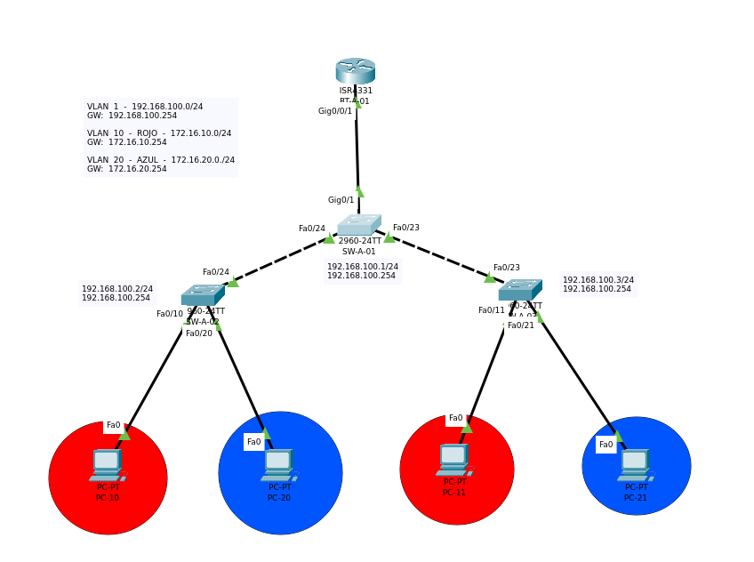

# Práctica 7

## Objetivo de la práctica

- Revisar y dominar los comandos de verificación en routers y switches Cisco para identificar:
  - Estado y parámetros de interfaces físicas y lógicas (SVI)
  - Tabla de direcciones MAC
  - Direcciones IP configuradas y vecindario ARP

## Materiales necesarios

- Packet Tracer
- Archivo .pkt de esta práctica: Practica_4.pkt

## Descripción del escenario

- Diagrama

  
- Lista de Dispositivos
  - Router
    - 4331 (1)
  - Switches
    - 2960 (3)
  - End Devices
    - PC (4)
- Direccionamiento IP
  - Utiliza el direccionamiento incluido en el .pkt. Si construyes el escenario desde cero, puedes usar 192.168.10.0/24 con gateway 192.168.10.254 y 2 PCs en la misma red.

## Requerimientos técnicos

- Ejecutar y documentar, en router y switch, los comandos para:
  - Ver el estado y detalles de interfaces
  - Ver y filtrar la tabla MAC
  - Ver direcciones IP, ARP y rutas conectadas
  - Descubrir vecinos con CDP/LLDP
- Generar tráfico para poblar tablas (pings entre hosts)
- Guardar evidencias de salida de comandos

---

Antes de iniciar, genera tráfico entre los hosts (ping PC-1 -> PC-2) para que el switch aprenda MACs.

### Resumen rápido de interfaces

```bash
SW-A-01#show interfaces status
```

Output:

```bash
Port      Name               Status       Vlan       Duplex  Speed Type
Fa0/1                        notconnect   1          auto    auto  10/100BaseTX
Fa0/2                        notconnect   1          auto    auto  10/100BaseTX
Fa0/3                        notconnect   1          auto    auto  10/100BaseTX
Fa0/4                        notconnect   1          auto    auto  10/100BaseTX
Fa0/5                        notconnect   1          auto    auto  10/100BaseTX
Fa0/6                        notconnect   1          auto    auto  10/100BaseTX
Fa0/7                        notconnect   1          auto    auto  10/100BaseTX
Fa0/8                        notconnect   1          auto    auto  10/100BaseTX
Fa0/9                        notconnect   1          auto    auto  10/100BaseTX
Fa0/10                       connected    1          auto    auto  10/100BaseTX
Fa0/11                       connected    1          auto    auto  10/100BaseTX
Fa0/12                       notconnect   1          auto    auto  10/100BaseTX
Fa0/13                       notconnect   1          auto    auto  10/100BaseTX
Fa0/14                       notconnect   1          auto    auto  10/100BaseTX
Fa0/15                       notconnect   1          auto    auto  10/100BaseTX
Fa0/16                       notconnect   1          auto    auto  10/100BaseTX
Fa0/17                       notconnect   1          auto    auto  10/100BaseTX
Fa0/18                       notconnect   1          auto    auto  10/100BaseTX
Fa0/19                       notconnect   1          auto    auto  10/100BaseTX
Fa0/20                       notconnect   1          auto    auto  10/100BaseTX
Fa0/21                       notconnect   1          auto    auto  10/100BaseTX
Fa0/22                       notconnect   1          auto    auto  10/100BaseTX
Fa0/23                       notconnect   1          auto    auto  10/100BaseTX
Fa0/24                       notconnect   1          auto    auto  10/100BaseTX
Gig0/1                       connected    1          auto    auto  10/100BaseTX
Gig0/2                       notconnect   1          auto    auto  10/100BaseTX
```


```bash
SW-A-01#show ip interface brief
```

```bash
Interface              IP-Address      OK? Method Status                Protocol 
FastEthernet0/1        unassigned      YES manual down                  down 
FastEthernet0/2        unassigned      YES manual down                  down 
FastEthernet0/3        unassigned      YES manual down                  down 
FastEthernet0/4        unassigned      YES manual down                  down 
FastEthernet0/5        unassigned      YES manual down                  down 
FastEthernet0/6        unassigned      YES manual down                  down 
FastEthernet0/7        unassigned      YES manual down                  down 
FastEthernet0/8        unassigned      YES manual down                  down 
FastEthernet0/9        unassigned      YES manual down                  down 
FastEthernet0/10       unassigned      YES manual up                    up 
FastEthernet0/11       unassigned      YES manual up                    up 
FastEthernet0/12       unassigned      YES manual down                  down 
FastEthernet0/13       unassigned      YES manual down                  down 
FastEthernet0/14       unassigned      YES manual down                  down 
FastEthernet0/15       unassigned      YES manual down                  down 
FastEthernet0/16       unassigned      YES manual down                  down 
FastEthernet0/17       unassigned      YES manual down                  down 
FastEthernet0/18       unassigned      YES manual down                  down 
FastEthernet0/19       unassigned      YES manual down                  down 
FastEthernet0/20       unassigned      YES manual down                  down 
FastEthernet0/21       unassigned      YES manual down                  down 
FastEthernet0/22       unassigned      YES manual down                  down 
FastEthernet0/23       unassigned      YES manual down                  down 
FastEthernet0/24       unassigned      YES manual down                  down 
GigabitEthernet0/1     unassigned      YES manual up                    up 
GigabitEthernet0/2     unassigned      YES manual down                  down 
Vlan1                  unassigned      YES manual administratively down down
```

Notas:
- show interfaces status es muy útil para ver “connected/notconnect” y velocidad/duplex.
- show ip interface brief muestra IPs de SVIs (si existen) y estado de capa 2/3.

### VLANs y troncales

```bash
SW-A-01#show vlan brief
SW-A-01#show interfaces trunk
```

Output:

```bash
VLAN Name                             Status    Ports
---- -------------------------------- --------- -------------------------------
1    default                          active    Fa0/1, Fa0/2, Fa0/3, Fa0/4
                                                Fa0/5, Fa0/6, Fa0/7, Fa0/8
                                                Fa0/9, Fa0/10, Fa0/11, Fa0/12
                                                Fa0/13, Fa0/14, Fa0/15, Fa0/16
                                                Fa0/17, Fa0/18, Fa0/19, Fa0/20
                                                Fa0/21, Fa0/22, Fa0/23, Fa0/24
                                                Gig0/1, Gig0/2
1002 fddi-default                     active    
1003 token-ring-default               active    
1004 fddinet-default                  active    
1005 trnet-default                    active 
```

Puntos clave que verás:
- VLAN asociada a los puertos del switch.


### Descubrimiento de vecinos

```bash
SW-A-01#show cdp neighbors

```
```bash
Capability Codes: R - Router, T - Trans Bridge, B - Source Route Bridge
                  S - Switch, H - Host, I - IGMP, r - Repeater, P - Phone
Device ID    Local Intrfce   Holdtme    Capability   Platform    Port ID
RT-A-01      Gig 0/1          135            R       ISR4300     Gig 0/0/1
```

```bash
SW-A-01#show cdp neighbors detail
```
```bash
Device ID: RT-A-01
Entry address(es): 
  IP address : 192.168.100.254
Platform: cisco ISR4300, Capabilities: Router
Interface: GigabitEthernet0/1, Port ID (outgoing port): GigabitEthernet0/0/1
Holdtime: 121

Version :
Cisco IOS XE Software, Version 03.13.04.S - Extended Support Release
Cisco IOS Software, ISR Software (X86_64_LINUX_IOSD-UNIVERSALK9-M), Version 15.5(3)S5, RELEASE SOFTWARE (fc2)
Technical Support: http://www.cisco.com/techsupport
Copyright (c) 1986-2017 by Cisco Systems, Inc.
Compiled Mon 05-Oct-15 11:24 by mcpre

advertisement version: 2
Duplex: full
```

Tip:
- CDP viene habilitado por defecto en la mayoría de switches Cisco.
- LLDP puede requerir habilitarse:

## Configuración básica

### Procedimiento en el Switch (SW-A-02)
```bash
Switch>enable
Switch#configure terminal
Enter configuration commands, one per line.  End with CNTL/Z.
Switch(config)#hostname SW-A-02
SW-A-02(config)#enable secret ufm
SW-A-02(config)#line console 0
SW-A-02(config-line)#password ufm
SW-A-02(config-line)#login
SW-A-02(config-line)#logging synchronous 
SW-A-02(config-line)#exec
SW-A-02(config-line)#exec-timeout 5 30
SW-A-02(config-line)#exit
SW-A-02(config)#line vty 0 15
SW-A-02(config-line)#password ufm
SW-A-02(config-line)#login
SW-A-02(config-line)#logging synchronous 
SW-A-02(config-line)#exe
SW-A-02(config-line)#exec-timeout 2 30
SW-A-02(config-line)#exit

SW-A-02(config)#interface vlan 1
SW-A-02(config-if)#ip address 192.168.100.2 255.255.255.0
SW-A-02(config-if)#no shutdown 
SW-A-02(config-if)#exit

SW-A-02(config)#ip default-gateway 192.168.100.254
SW-A-02(config)#service password-encryption 
SW-A-02(config)#no ip domain-lookup 
```

### Procedimiento en el Switch (SW-A-03)
```bash
Switch>enable
Switch#configure terminal
Switch(config)#hostname SW-A-03
SW-A-03(config)#
SW-A-03(config)#line console 0
SW-A-03(config-line)#password ufm
SW-A-03(config-line)#login
SW-A-03(config-line)#logging synchronous 
SW-A-03(config-line)#exec-timeout 5 30
SW-A-03(config-line)#exit
SW-A-03(config)#line vty 0 15
SW-A-03(config-line)#pas
SW-A-03(config-line)#password ufm
SW-A-03(config-line)#login 
SW-A-03(config-line)#logging synchronous 
SW-A-03(config-line)#exec-timeout 2 30
SW-A-03(config-line)#exit

SW-A-03(config)#interface vlan 1
SW-A-03(config-if)#ip address 192.168.100.3 255.255.255.0
SW-A-03(config-if)#no shutdown 
SW-A-03(config-if)#exit

SW-A-03(config)#ip default-gateway 192.168.100.254
SW-A-03(config)#service password-encryption 
SW-A-03(config)#no ip domain-lookup 
```

## Creación y asignación de VLAN's
### Procedimiento en el Switch (SW-A-02)
```bash
SW-A-02(config)#vlan 10
SW-A-02(config-vlan)#name ROJO
SW-A-02(config-vlan)#exit

SW-A-02(config)#vlan 20
SW-A-02(config-vlan)#name AZUL
SW-A-02(config-vlan)#exit
```

Asignación de VLANs a Interfaces:
```bash
SW-A-02(config)#interface fastEthernet 0/10
SW-A-02(config-if)#switchport mode access 
SW-A-02(config-if)#switchport access vlan 10
SW-A-02(config-if)#exit

SW-A-02(config)#interface fastEthernet 0/20
SW-A-02(config-if)#switchport mode access 
SW-A-02(config-if)#switchport access vlan 20
SW-A-02(config-if)#exit
```
Para verificar:
```bash
VLAN Name                             Status    Ports
---- -------------------------------- --------- -------------------------------
1    default                          active    Fa0/1, Fa0/2, Fa0/3, Fa0/4
                                                Fa0/5, Fa0/6, Fa0/7, Fa0/8
                                                Fa0/9, Fa0/11, Fa0/12, Fa0/13
                                                Fa0/14, Fa0/15, Fa0/16, Fa0/17
                                                Fa0/18, Fa0/19, Fa0/21, Fa0/22
                                                Fa0/23, Fa0/24, Gig0/1, Gig0/2
10   ROJO                             active    Fa0/10
20   AZUL                             active    Fa0/20
1002 fddi-default                     active    
1003 token-ring-default               active    
1004 fddinet-default                  active    
1005 trnet-default                    active    
```

### Procedimiento en el Switch (SW-A-03)
```bash
SW-A-03(config)#vlan 10
SW-A-03(config-vlan)#name ROJO
SW-A-03(config-vlan)#exit

SW-A-03(config)#vlan 20
SW-A-03(config-vlan)#name AZUL
SW-A-03(config-vlan)#exit
```
Para verificar la creación de las VLANs
```bash
VLAN Name                             Status    Ports
---- -------------------------------- --------- -------------------------------
1    default                          active    Fa0/1, Fa0/2, Fa0/3, Fa0/4
                                                Fa0/5, Fa0/6, Fa0/7, Fa0/8
                                                Fa0/9, Fa0/10, Fa0/11, Fa0/12
                                                Fa0/13, Fa0/14, Fa0/15, Fa0/16
                                                Fa0/17, Fa0/18, Fa0/19, Fa0/20
                                                Fa0/21, Fa0/22, Fa0/23, Fa0/24
                                                Gig0/1, Gig0/2
10   ROJO                             active    
20   AZUL                             active    
1002 fddi-default                     active    
1003 token-ring-default               active    
1004 fddinet-default                  active    
1005 trnet-default                    active 
```
Asignación de VLANs a Interfaces:
```bash
SW-A-03(config)#interface fastEthernet 0/11
SW-A-03(config-if)#switchport mode access 
SW-A-03(config-if)#switchport access vlan 10
SW-A-03(config-if)#exit

SW-A-03(config)#interface fastEthernet 0/21
SW-A-03(config-if)#switchport mode access 
SW-A-03(config-if)#switchport access vlan 20
SW-A-03(config-if)#exit
```
Para verificar:
```bash
VLAN Name                             Status    Ports
---- -------------------------------- --------- -------------------------------
1    default                          active    Fa0/1, Fa0/2, Fa0/3, Fa0/4
                                                Fa0/5, Fa0/6, Fa0/7, Fa0/8
                                                Fa0/9, Fa0/11, Fa0/12, Fa0/13
                                                Fa0/14, Fa0/15, Fa0/16, Fa0/17
                                                Fa0/18, Fa0/19, Fa0/21, Fa0/22
                                                Fa0/23, Fa0/24, Gig0/1, Gig0/2
10   ROJO                             active    Fa0/11
20   AZUL                             active    Fa0/21
1002 fddi-default                     active    
1003 token-ring-default               active    
1004 fddinet-default                  active    
1005 trnet-default                    active    
```

## Asignación de Interfaces Troncales

### Procedimiento en el Switch (SW-A-02)
```bash
SW-A-02(config)#interface fastEthernet 0/24
SW-A-02(config-if)#switchport mode trunk 
SW-A-02(config-if)#switchport nonegotiate 
SW-A-02(config-if)#exit
```
Para verificar:
```bash
SW-A-02#show interface trunk 
Port        Mode         Encapsulation  Status        Native vlan
Fa0/24      on           802.1q         trunking      1

Port        Vlans allowed on trunk
Fa0/24      1-1005

Port        Vlans allowed and active in management domain
Fa0/24      1,10,20

Port        Vlans in spanning tree forwarding state and not pruned
Fa0/24      1,10,20
```
### Procedimiento en el Switch (SW-A-03)
```bash
SW-A-03(config)#interface fastEthernet 0/23
SW-A-03(config-if)#switchport mode trunk 
SW-A-03(config-if)#switchport nonegotiate 
SW-A-03(config-if)#exit
```
Para verificar:
```bash
SW-A-03#show interface trunk 
Port        Mode         Encapsulation  Status        Native vlan
Fa0/23      on           802.1q         trunking      1

Port        Vlans allowed on trunk
Fa0/23      1-1005

Port        Vlans allowed and active in management domain
Fa0/23      1,10,20

Port        Vlans in spanning tree forwarding state and not pruned
Fa0/23      1,10,20

```
### Procedimiento en el Switch (SW-A-01)
```bash
Switch>enable
Switch#configure terminal
Switch(config)#hostname SW-A-01
SW-A-01(config)#
```

```bash
SW-A-01#configure terminal 
SW-A-01(config)#enable secret ufm
SW-A-01(config)#line console 0
SW-A-01(config-line)#password ufm
SW-A-01(config-line)#login
SW-A-01(config-line)#loggi synchronous 
SW-A-01(config-line)#exec-timeout 5 30
SW-A-01(config-line)#exit
SW-A-01(config)#line vty 0 15 
SW-A-01(config-line)#password ufm
SW-A-01(config-line)#login
SW-A-01(config-line)#logging synchronous 
SW-A-01(config-line)#exec-timeout 2 30
SW-A-01(config-line)#exit
```
```bash
SW-A-01(config)#interface vlan 1
SW-A-01(config-if)#ip address 192.168.100.1 255.255.255.0
SW-A-01(config-if)#no shutdown 
SW-A-01(config-if)#exit

SW-A-01(config)#ip default-gateway 192.168.100.254
SW-A-01(config)#service password-encryption 
SW-A-01(config)#no ip domain-lookup 
```
```bash
SW-A-01(config)#vlan 10
SW-A-01(config-vlan)#name ROJO
SW-A-01(config-vlan)#exit
SW-A-01(config)#vlan 20
SW-A-01(config-vlan)#name AZUL
SW-A-01(config-vlan)#exit
```
```bash
VLAN Name                             Status    Ports
---- -------------------------------- --------- -------------------------------
1    default                          active    Fa0/1, Fa0/2, Fa0/3, Fa0/4
                                                Fa0/5, Fa0/6, Fa0/7, Fa0/8
                                                Fa0/9, Fa0/10, Fa0/11, Fa0/12
                                                Fa0/13, Fa0/14, Fa0/15, Fa0/16
                                                Fa0/17, Fa0/18, Fa0/19, Fa0/20
                                                Fa0/21, Fa0/22, Fa0/23, Fa0/24
                                                Gig0/1, Gig0/2
10   ROJO                             active    
20   AZUL                             active    
1002 fddi-default                     active    
1003 token-ring-default               active    
1004 fddinet-default                  active    
1005 trnet-default                    active 
```
```bash
SW-A-01(config)#interface fastEthernet 0/24
SW-A-01(config-if)#switchport mode trunk 
SW-A-01(config-if)#switchport nonegotiate 
SW-A-01(config-if)#exit

SW-A-01(config)#interface fastEthernet 0/23
SW-A-01(config-if)#switchport mode trunk 
SW-A-01(config-if)#switchport nonegotiate 
SW-A-01(config-if)#exit

SW-A-01(config)#interface gigabitEthernet 0/1
SW-A-01(config-if)#switchport mode trunk 
SW-A-01(config-if)#switchport nonegotiate 
SW-A-01(config-if)#exit
```
```bash
SW-A-01#show interface trunk 
Port        Mode         Encapsulation  Status        Native vlan
Fa0/23      on           802.1q         trunking      1
Fa0/24      on           802.1q         trunking      1
Gig0/1      on           802.1q         trunking      1

Port        Vlans allowed on trunk
Fa0/23      1-1005
Fa0/24      1-1005
Gig0/1      1-1005

Port        Vlans allowed and active in management domain
Fa0/23      1,10,20
Fa0/24      1,10,20
Gig0/1      1,10,20

Port        Vlans in spanning tree forwarding state and not pruned
Fa0/23      1,10,20
Fa0/24      1,10,20
Gig0/1      1,10,20
```
### Procedimiento en el Router (RT-A-01)

Genera tráfico primero (pings a PCs) para poblar ARP y verificar conectividad.

### Configuración básica

```bash
Router>enable
Router#configure terminal
Enter configuration commands, one per line.  End with CNTL/Z.
Router(config)#hostname RT-A-01
```

```bash
RT-A-01#configure terminal 
RT-A-01(config)#enable secret ufm
RT-A-01(config)#line console 0
RT-A-01(config-line)#password ufm
RT-A-01(config-line)#login 
RT-A-01(config-line)#logging synchronous 
RT-A-01(config-line)#exec-timeout 5 30
RT-A-01(config-line)#exit

RT-A-01(config)#line vty 0 15
RT-A-01(config-line)#password ufm
RT-A-01(config-line)#login
RT-A-01(config-line)#logging synchronous 
RT-A-01(config-line)#exec-timeout 2 30
RT-A-01(config-line)#exit

RT-A-01(config)#service password-encryption 
RT-A-01(config)#no ip domain-lookup 
```
### Configuración de Interfaces
```bash
RT-A-01(config)#interface GigabitEthernet0/0/1
RT-A-01(config-if)#ip address 192.168.100.254 255.255.255.0
RT-A-01(config-if)#no shutdown
```
VLANs
```bash
RT-A-01(config)#interface gigabitEthernet 0/0/1.10
RT-A-01(config-subif)#encapsulation dot1Q 10
RT-A-01(config-subif)#ip address 172.16.10.254 255.255.255.0
RT-A-01(config-subif)#exit

RT-A-01(config)#interface gigabitEthernet 0/0/1.20
RT-A-01(config-subif)#encapsulation dot1Q 20
RT-A-01(config-subif)#ip address 172.16.20.254 255.255.255.0
RT-A-01(config-subif)#exit
```

```bash
RT-A-01#show ip interface brief 
Interface              IP-Address      OK? Method Status                Protocol 
GigabitEthernet0/0/0   unassigned      YES unset  administratively down down 
GigabitEthernet0/0/1   192.168.100.254 YES manual up                    up 
GigabitEthernet0/0/1.2 unassigned      YES unset  up                    up 
GigabitEthernet0/0/1.10172.16.10.254   YES manual up                    up 
GigabitEthernet0/0/1.20172.16.20.254   YES manual up                    up 
GigabitEthernet0/0/2   unassigned      YES unset  administratively down down 
Vlan1                  unassigned      YES unset  administratively down down
```
### Configuración de DHCP
```bash
RT-A-01(config)#ip dhcp pool VLAN-10
RT-A-01(dhcp-config)#network 172.16.10.0 255.255.255.0
RT-A-01(dhcp-config)#default-router 172.16.10.254
RT-A-01(dhcp-config)#exit
RT-A-01(config)#ip dhcp excluded-address 172.16.10.1 172.16.10.20
```

```bash
RT-A-01(config)#ip dhcp pool VLAN-20
RT-A-01(dhcp-config)#network 172.16.20.0 255.255.255.0
RT-A-01(dhcp-config)#default-router 172.16.20.254
RT-A-01(dhcp-config)#exit
RT-A-01(config)#ip dhcp excluded-address 172.16.20.1 172.16.20.20
```
Verificación de IP:

PC-10
```bash
FastEthernet0 Connection:(default port)

   Connection-specific DNS Suffix..: 
   Link-local IPv6 Address.........: FE80::260:70FF:FE8E:9B89
   IPv6 Address....................: ::
   IPv4 Address....................: 172.16.10.21
   Subnet Mask.....................: 255.255.255.0
   Default Gateway.................: ::
                                     172.16.10.254
```
PC-11
```bash
FastEthernet0 Connection:(default port)

   Connection-specific DNS Suffix..: 
   Link-local IPv6 Address.........: FE80::200:CFF:FE4A:A82E
   IPv6 Address....................: ::
   IPv4 Address....................: 172.16.10.22
   Subnet Mask.....................: 255.255.255.0
   Default Gateway.................: ::
                                     172.16.10.254
```
PC-20
```bash
FastEthernet0 Connection:(default port)

   Connection-specific DNS Suffix..: 
   Link-local IPv6 Address.........: FE80::202:17FF:FE21:2465
   IPv6 Address....................: ::
   IPv4 Address....................: 172.16.20.21
   Subnet Mask.....................: 255.255.255.0
   Default Gateway.................: ::
                                     172.16.20.254
```
PC-21
```bash
FastEthernet0 Connection:(default port)

   Connection-specific DNS Suffix..: 
   Link-local IPv6 Address.........: FE80::260:70FF:FEA9:BE9C
   IPv6 Address....................: ::
   IPv4 Address....................: 172.16.20.22
   Subnet Mask.....................: 255.255.255.0
   Default Gateway.................: ::
                                     172.16.20.254
```

## Tabla de referencia rápida

Switch (2960):
- show interfaces status
- show interfaces description
- show ip interface brief
- show vlan brief
- show interfaces trunk
- show interfaces TYPE/NUM
- show running-config interface TYPE/NUM
- show mac address-table [dynamic|interface X|address MAC]
- clear mac address-table dynamic
- show arp
- show cdp neighbors [detail]
- show lldp neighbors [detail]

Router (4331):
- show ip interface brief
- show interfaces description
- show interfaces TYPE/NUM
- show ip interface TYPE/NUM
- show running-config interface TYPE/NUM
- show arp / show ip arp
- show ip route [connected]
- ping X.X.X.X
- traceroute X.X.X.X
- show cdp neighbors [detail]
- show lldp neighbors [detail]

---

## Buenas prácticas

- Genera tráfico (ping) antes de revisar MAC/ARP.
- Usa description en interfaces para facilitar identificación.
- Verifica dúplex/velocidad y errores físicos al diagnosticar.
- Guarda evidencia con copy run start antes de cerrar la práctica.
